# SmartBackup — Comprehensive Codebase Analysis

> **Document generated**: February 23, 2026
> **Version analyzed**: 0.4.0
> **Repository**: `smartbackup_file-backup-automation`
> **Author**: Muhammed Musab Kaya (@CodingWithMK)
> **License**: MIT

---

## Table of Contents

- [1. Executive Summary](#1-executive-summary)
- [2. Product Manager Perspective](#2-product-manager-perspective)
  - [2.1 Problem Statement](#21-problem-statement)
  - [2.2 Value Proposition](#22-value-proposition)
  - [2.3 Target Users](#23-target-users)
  - [2.4 Feature Inventory](#24-feature-inventory)
  - [2.5 User Journey](#25-user-journey)
  - [2.6 Competitive Landscape](#26-competitive-landscape)
  - [2.7 Product Roadmap](#27-product-roadmap)
  - [2.8 Risks & Gaps](#28-risks--gaps)
- [3. Software Architect Perspective](#3-software-architect-perspective)
  - [3.1 High-Level Architecture](#31-high-level-architecture)
  - [3.2 Package & Module Structure](#32-package--module-structure)
  - [3.3 Layer Diagram](#33-layer-diagram)
  - [3.4 Component Interaction](#34-component-interaction)
  - [3.5 Data Flow](#35-data-flow)
  - [3.6 Backup Lifecycle](#36-backup-lifecycle)
  - [3.7 Restore Lifecycle](#37-restore-lifecycle)
  - [3.8 Multi-Device Architecture](#38-multi-device-architecture)
  - [3.9 Manifest System Architecture](#39-manifest-system-architecture)
  - [3.10 Platform Abstraction](#310-platform-abstraction)
  - [3.11 Design Patterns](#311-design-patterns)
  - [3.12 Design Principles & Quality Attributes](#312-design-principles--quality-attributes)
  - [3.13 Dependency Graph](#313-dependency-graph)
- [4. Software Developer Perspective](#4-software-developer-perspective)
  - [4.1 Technology Stack](#41-technology-stack)
  - [4.2 Project Layout](#42-project-layout)
  - [4.3 Module Deep-Dive](#43-module-deep-dive)
  - [4.4 Class Hierarchy & Type System](#44-class-hierarchy--type-system)
  - [4.5 Key Data Models](#45-key-data-models)
  - [4.6 Concurrency Model](#46-concurrency-model)
  - [4.7 Error Handling Strategy](#47-error-handling-strategy)
  - [4.8 Configuration System](#48-configuration-system)
  - [4.9 CLI Design](#49-cli-design)
  - [4.10 Testing Strategy](#410-testing-strategy)
  - [4.11 Code Metrics](#411-code-metrics)
  - [4.12 Build & Packaging](#412-build--packaging)
  - [4.13 Developer Workflow](#413-developer-workflow)
- [5. Cross-Cutting Concerns](#5-cross-cutting-concerns)
  - [5.1 Security Considerations](#51-security-considerations)
  - [5.2 Performance Profile](#52-performance-profile)
  - [5.3 Extensibility Points](#53-extensibility-points)
  - [5.4 Technical Debt Inventory](#54-technical-debt-inventory)
- [6. Appendix](#6-appendix)
  - [6.1 Full Exclusion List](#61-full-exclusion-list)
  - [6.2 Excluded File Extensions](#62-excluded-file-extensions)
  - [6.3 Glossary](#63-glossary)

---

## 1. Executive Summary

**SmartBackup** is a cross-platform, zero-dependency, incremental backup system written in pure Python, purpose-built for software developers. It solves the specific problem of backing up developer workstations—where directories like `node_modules`, `venv`, `.git`, and `__pycache__` inflate backup times by orders of magnitude—by automatically filtering these artifacts before copying.

The codebase is structured as a well-modularized Python package (23 source files, ~3,342 lines of production code) with 194 tests (~2,637 lines of test code). It follows a clean `src` layout with four internal sub-packages: `core/`, `manifest/`, `platform/`, and `ui/`. The project has evolved through three minor releases (v0.1.0 → v0.4.0), progressively adding a manifest-based incremental backup system, restore capabilities, multi-device support, and a modernized CLI with Rich and Typer.

Key architectural highlights:
- **Zero external dependencies** — uses only the Python standard library
- **Multi-threaded file I/O** via `concurrent.futures.ThreadPoolExecutor`
- **JSON-based manifest tracking** for 10× faster incremental backups
- **Cross-platform path resolution** for Windows, macOS, and Linux
- **Per-device backup isolation** enabling shared external drives

---

## 2. Product Manager Perspective

### 2.1 Problem Statement

Developers frequently store large dependency trees within their working directories:

| Technology | Artifact Directory | Typical Size |
|---|---|---|
| Node.js | `node_modules/` | 200 MB – 2 GB per project |
| Python | `venv/`, `.venv/` | 50 – 500 MB per project |
| Java/Kotlin | `target/`, `.gradle/` | 100 MB – 1 GB |
| Rust | `target/` | 500 MB – 5 GB |
| .NET | `bin/`, `obj/` | 50 – 300 MB |

A developer's Documents folder may contain 10+ projects, easily adding 5–20 GB of *regenerable* data. Traditional backup tools copy everything, leading to:
- Backup times measured in **hours instead of minutes**
- Consumed storage **10× larger than necessary**
- Frustration that discourages regular backups

### 2.2 Value Proposition

| Dimension | Without SmartBackup | With SmartBackup |
|---|---|---|
| Backup Time | Hours | Minutes |
| Storage Used | 10–50 GB | 1–5 GB |
| Configuration | Manual exclude lists | Zero-config |
| Dependencies | Heavy backup software | Pure Python, zero deps |
| Multi-Device | Conflicts on shared drives | Automatic isolation |

### 2.3 Target Users


### 2.4 Feature Inventory

| Feature | Version | Status | Category |
|---|---|---|---|
| Cross-platform support (Windows/macOS/Linux) | 0.1.0 | ✅ Shipped | Core |
| Smart filtering of dev artifacts | 0.1.0 | ✅ Shipped | Core |
| Incremental backup (size + timestamp) | 0.1.0 | ✅ Shipped | Core |
| Multi-threaded file copying | 0.1.0 | ✅ Shipped | Performance |
| Auto-detection of external drives | 0.1.0 | ✅ Shipped | UX |
| Progress bar with colored output | 0.1.0 | ✅ Shipped | UX |
| Detailed log files on backup drive | 0.1.0 | ✅ Shipped | Observability |
| Fallback when no drive found | 0.1.0 | ✅ Shipped | UX |
| CLI with argparse | 0.1.0 | ✅ Shipped | Interface |
| JSON manifest tracking | 0.2.0 | ✅ Shipped | Performance |
| Restore engine with pattern filtering | 0.2.0 | ✅ Shipped | Core |
| Manifest verification (`--verify`) | 0.2.0 | ✅ Shipped | Integrity |
| Modular codebase (from monolith) | 0.2.0 | ✅ Shipped | Architecture |
| macOS drive detection fix | 0.2.1 | ✅ Shipped | Bugfix |
| Per-device backup subfolders | 0.3.0 | ✅ Shipped | Multi-Device |
| Legacy layout auto-migration | 0.3.0 | ✅ Shipped | Migration |
| Hostname-based device identity | 0.3.0 | ✅ Shipped | Multi-Device |
| Rich + Typer CLI modernization | 0.4.0 | ✅ Shipped | UX |
| Compression support (zip/tar.gz) | 0.5.0 | 🔲 Planned | Performance |
| SQLite manifest | 0.5.0 | 🔲 Planned | Scalability |
| Quick hash comparison (xxhash/blake3) | 0.5.0 | 🔲 Planned | Integrity |
| Encryption support | 0.6.0 | 🔲 Planned | Security |
| Backup profiles | 0.6.0 | 🔲 Planned | UX |
| Resume interrupted backups | 0.6.0 | 🔲 Planned | Reliability |

### 2.5 User Journey


### 2.6 Competitive Landscape

| Tool | Smart Filtering | Zero Deps | Cross-Platform | Incremental | Manifest | Target Audience |
|---|---|---|---|---|---|---|
| **SmartBackup** | ✅ Dev-aware | ✅ | ✅ | ✅ | ✅ JSON | Developers |
| rsync | ❌ Manual excludes | ❌ System tool | ❌ Unix only | ✅ | ❌ | Sysadmins |
| robocopy | ❌ Manual excludes | ✅ Built-in | ❌ Windows only | ✅ | ❌ | Windows admins |
| Time Machine | ❌ | ✅ | ❌ macOS only | ✅ | ✅ Proprietary | macOS users |
| Duplicati | ❌ | ❌ .NET runtime | ✅ | ✅ | ✅ SQLite | General |
| BorgBackup | ❌ | ❌ | ❌ Unix only | ✅ | ✅ | Power users |

**Differentiation**: SmartBackup's niche is the intersection of *developer awareness* (smart filtering) + *zero configuration* + *zero dependencies*. No other tool auto-excludes `node_modules`, `venv`, `__pycache__`, etc. out of the box.

### 2.7 Product Roadmap


### 2.8 Risks & Gaps

| Risk | Severity | Mitigation |
|---|---|---|
| No encryption — sensitive data exposed on backup drive | High | Planned for v0.5.0 |
| No cloud backup — local-only | Medium | Could be added via backend abstraction |
| No GUI — CLI-only limits adoption | Medium | Could add TUI or web dashboard |
| JSON manifest doesn't scale to 100K+ files | Medium | SQLite manifest planned for v0.4.0 |
| No backup scheduling built-in | Low | `SchedulerHelper` provides instructions for OS schedulers |
| No file-level deduplication | Low | Keep storage costs acceptable via filtering |
| Deleted files in source are NOT deleted in backup by default | Low | Safety-first design, opt-in deletion possible |

---

## 3. Software Architect Perspective

### 3.1 High-Level Architecture

SmartBackup follows a **layered architecture** with clear separation of concerns across four layers:


### 3.2 Package & Module Structure

```
src/smartbackup/
├── __init__.py          (92 LOC)   # Package facade — exports all public API
├── __main__.py           (7 LOC)   # python -m entry point
├── backup.py           (136 LOC)   # SmartBackup orchestrator class
├── cli.py              (425 LOC)   # CLI parsing, subcommands, entry point
├── config.py           (200 LOC)   # BackupConfig dataclass, ConfigManager, exclusions
├── handlers.py          (83 LOC)   # FallbackHandler (no-drive scenarios)
├── models.py            (71 LOC)   # FileInfo, FileAction, BackupResult
│
├── core/
│   ├── __init__.py      (17 LOC)   # Sub-package exports
│   ├── engine.py       (398 LOC)   # BackupEngine, DryRunBackupEngine
│   ├── scanner.py      (205 LOC)   # ExclusionFilter, FileScanner
│   ├── detector.py      (88 LOC)   # ChangeDetector (traditional diff)
│   └── restore.py      (371 LOC)   # RestoreEngine, RestoreResult
│
├── manifest/
│   ├── __init__.py      (25 LOC)   # Sub-package exports
│   ├── base.py         (408 LOC)   # ManifestEntry, Manifest, ManifestDiff, ManifestManager ABC
│   └── json_manifest.py(102 LOC)   # JsonManifestManager (concrete implementation)
│
├── platform/
│   ├── __init__.py       (8 LOC)   # Sub-package exports
│   ├── resolver.py     (196 LOC)   # PathResolver (documents path, external drives)
│   ├── devices.py       (96 LOC)   # DeviceDetector (find + validate backup device)
│   ├── identity.py      (36 LOC)   # get_device_name() hostname utility
│   └── scheduler.py    (133 LOC)   # SchedulerHelper (cron/launchd/Task Scheduler)
│
└── ui/
    ├── __init__.py       (6 LOC)   # Sub-package exports
    ├── colors.py        (23 LOC)   # ANSI color codes
    └── logger.py       (216 LOC)   # BackupLogger with progress bar
```

**Total**: 23 source files, 3,342 lines of production code.

### 3.3 Layer Diagram


### 3.4 Component Interaction

The following sequence diagram shows what happens during a typical backup operation:


### 3.5 Data Flow


### 3.6 Backup Lifecycle


### 3.7 Restore Lifecycle

```mermaid
stateDiagram-v2
    [*] --> ParseArgs: smartbackup restore
    ParseArgs --> ValidateBackup: --source /path/to/backup
    ValidateBackup --> ResolveTarget: Backup dir exists

    state ResolveTarget {
        [*] --> CheckManifest
        CheckManifest --> UseManifestSource: Manifest has source path
        CheckManifest --> UseCLITarget: --target specified
        CheckManifest --> Error: No target found
    }

    ResolveTarget --> CollectFiles: Target resolved
    CollectFiles --> ApplyPatterns: Find all backup files
    ApplyPatterns --> FilterInternal: Apply --pattern if any

    state RestoreFiles {
        [*] --> ThreadPool
        ThreadPool --> CheckConflict
        CheckConflict --> Skip: File exists & --no-overwrite
        CheckConflict --> AtomicCopy: New file or --overwrite
        AtomicCopy --> [*]: copy2 → .tmp → rename
        Skip --> [*]
    }

    FilterInternal --> RestoreFiles
    RestoreFiles --> PrintSummary
    PrintSummary --> [*]
```



### 3.8 Multi-Device Architecture

Version 0.3.0 introduced per-device backup isolation. Multiple machines can safely share a single external drive:


**Legacy migration**: When the engine detects a flat layout (manifest at backup root), it automatically moves all contents into a device-named subfolder. This is handled by `BackupEngine._migrate_legacy_layout()`.

### 3.9 Manifest System Architecture


The manifest system uses a **Strategy pattern**: `ManifestManager` defines the abstract interface, while `JsonManifestManager` provides the concrete JSON implementation. The `ManifestFormat` enum already includes `SQLITE` as a future storage backend.

**Atomic writes**: `JsonManifestManager.save()` writes to a `.json.tmp` file first, then atomically renames it to prevent data corruption on interruption.

### 3.10 Platform Abstraction


### 3.11 Design Patterns

| Pattern | Where Used | Description |
|---|---|---|
| **Facade** | `SmartBackup` class | Simplifies interaction with engine, device detection, path resolution |
| **Strategy** | `ManifestManager` → `JsonManifestManager` | Pluggable manifest storage backends |
| **Template Method** | `BackupEngine` → `DryRunBackupEngine` | Override `_copy_single_file()` for simulation |
| **Builder** | `BackupConfig` dataclass | Immutable configuration built with defaults + overrides |
| **Observer-like** | `BackupLogger` + progress callbacks | Centralized logging with thread-safe progress |
| **Factory Method** | `ManifestEntry.from_file_info()`, `Manifest.from_dict()` | Alternative constructors for domain objects |
| **Null Object** | `BackupLogger(verbose=False)` | Silent logger that suppresses output |
| **Command** | `FileAction` enum + action dispatch | Encapsulates file operations as typed actions |

### 3.12 Design Principles & Quality Attributes

| Principle | Evidence |
|---|---|
| **Zero Dependencies** | Only Python stdlib; no pip packages for production use |
| **Cross-Platform** | Platform-specific code isolated in `platform/` package |
| **Safety First** | Deleted files in source are NOT auto-deleted from backup |
| **Atomic Operations** | Manifest saved via temp-file + rename; restore uses `.tmp` → `replace()` |
| **Graceful Degradation** | If manifest is corrupt, falls back to full scan; if no drive, offers local backup |
| **Incremental by Default** | Manifest-based diff avoids re-scanning backup directory |
| **Thread Safety** | `threading.Lock` protects shared result state during concurrent copies |
| **Idempotency** | Running the same backup twice produces no changes on second run |

### 3.13 Dependency Graph


---

## 4. Software Developer Perspective

### 4.1 Technology Stack

| Layer | Technology | Notes |
|---|---|---|
| Language | Python 3.9+ (dev: 3.12) | Minimum 3.9 for user compatibility |
| Build System | Hatchling | Modern PEP 517 build backend |
| Package Layout | `src/` layout | Standard for library-style packages |
| Testing | pytest 7.0+ | With pytest-cov for coverage |
| Linting | ruff 0.1+ | Fast Python linter (replaces flake8+isort) |
| Dependencies | **None** (stdlib only) | Zero external runtime dependencies |
| Concurrency | `concurrent.futures` | ThreadPoolExecutor for file I/O |
| Hashing | `hashlib.md5` | For optional file integrity checks |
| Serialization | `json` (stdlib) | Manifest storage |
| CLI | `argparse` (stdlib) | With subcommands for restore |
| Cross-platform | `platform`, `os`, `shutil` | Platform detection + file operations |

### 4.2 Project Layout

```
smartbackup_file-backup-automation/
├── main.py                     # Quick entry: sys.path fix + import main()
├── pyproject.toml              # Project metadata, build config, tool config
├── LICENSE                     # MIT
├── README.md                   # User-facing docs (486 lines)
├── docs/
│   ├── CHANGELOG.md            # Versioned changelog (137 lines)
│   └── CONTRIBUTING.md         # Contribution guide
├── src/
│   └── smartbackup/            # Main package (23 files, 3,342 LOC)
│       ├── __init__.py         # Public API facade
│       ├── __main__.py         # python -m support
│       ├── backup.py           # SmartBackup orchestrator
│       ├── cli.py              # CLI entry point
│       ├── config.py           # Config + exclusions
│       ├── handlers.py         # Fallback handlers
│       ├── models.py           # Data classes
│       ├── core/               # Engine + scanning + detection + restore
│       ├── manifest/           # Manifest tracking (base + JSON impl)
│       ├── platform/           # OS-specific: paths, drives, identity, scheduler
│       └── ui/                 # Colors + logger
└── tests/                      # Test suite (14 files, 2,637 LOC, 194 tests)
    ├── conftest.py             # Shared fixtures
    ├── test_backup.py          # Integration tests
    ├── test_cli.py             # CLI tests
    ├── test_config.py          # Config tests
    ├── test_detector.py        # Change detection tests
    ├── test_engine.py          # Backup engine tests
    ├── test_identity.py        # Device identity tests
    ├── test_logger.py          # Logger + colors tests
    ├── test_manifest.py        # Manifest system tests (548 LOC — largest)
    ├── test_models.py          # Data model tests
    ├── test_resolver.py        # Path resolver tests
    ├── test_restore.py         # Restore engine tests
    └── test_scanner.py         # Scanner + filter tests
```

### 4.3 Module Deep-Dive

#### 4.3.1 `backup.py` — SmartBackup Orchestrator

The `SmartBackup` class is the facade that ties everything together. It:

1. Prints a decorative ASCII banner
2. Resolves source path (default: Documents) and device name (hostname)
3. Attempts to find an external drive (with up to 3 retries + fallback)
4. Creates a `BackupConfig` with sensible defaults
5. Delegates to `BackupEngine.run_backup()`
6. Prints a summary and notifies completion

**Key design decision**: The orchestrator is intentionally thin (~100 LOC of logic). Complex behavior lives in the engine and scanner.

#### 4.3.2 `core/engine.py` — BackupEngine

The largest core module (398 LOC). Responsibilities:

- **Path validation**: Checks source exists, backup writable (via test file write)
- **Legacy migration**: Detects flat backup layout and moves into device subfolder
- **Manifest integration**: Loads/creates manifest, computes diff, updates after backup
- **Multi-threaded copying**: Uses `ThreadPoolExecutor` with configurable `max_workers`
- **Progress tracking**: Thread-safe counters with `threading.Lock`
- **Log file generation**: Writes structured log to `_backup_logs/` on backup drive

`DryRunBackupEngine` extends `BackupEngine` via template method: it overrides `_copy_single_file()` to return `"DRY-RUN"` without touching the filesystem.

#### 4.3.3 `core/scanner.py` — FileScanner & ExclusionFilter

Two classes with distinct responsibilities:

- **`ExclusionFilter`**: Takes exclusion patterns + extensions at construction, precompiles regex patterns from glob-style wildcards, and provides `should_exclude(path)` → `(bool, reason)`. Also detects Python virtual environments by checking for `pyvenv.cfg` / `bin/activate`.

- **`FileScanner`**: Performs recursive directory traversal using `os.scandir()` (not `Path.rglob()`—for performance). Applies the filter at each node, accumulates `FileInfo` objects, and optionally computes MD5 hashes for large files.

#### 4.3.4 `core/detector.py` — ChangeDetector

Traditional (non-manifest) change detection. Compares source `Dict[Path, FileInfo]` against the backup directory by:
1. Scanning all existing backup files via `rglob("*")`
2. For each source file: check if backup exists → new; check size/mtime → modified
3. Remaining backup files not in source → deleted

This is the **fallback path** when `--no-manifest` is used.

#### 4.3.5 `core/restore.py` — RestoreEngine

Mirrors the backup engine in structure:
- Resolves backup target (device subfolder or legacy layout)
- Collects files to restore (skipping `_backup_logs/` and `.smartbackup*`)
- Applies optional glob pattern filtering
- Multi-threaded restore with conflict resolution (skip/overwrite/newer/rename)
- **Atomic file writes**: `copy2 → .tmp → replace()` pattern prevents corruption

#### 4.3.6 `manifest/` — Tracking System

The manifest system is the backbone of incremental backups:

- **`ManifestEntry`**: Per-file metadata (hash, size, mtime, permissions, backed_up_at)
- **`Manifest`**: Container with metadata (version, source, hostname, timestamps) + entry map
- **`ManifestDiff`**: Result of comparing source files vs. manifest entries
- **`ManifestManager`** (ABC): Defines `load`, `save`, `diff`, `update_from_backup`, `verify`
- **`JsonManifestManager`**: Stores as `.smartbackup_manifest.json` with atomic writes

Change detection is O(n) where n = number of source files, with O(1) lookups against the manifest dictionary. This is much faster than the traditional approach which requires O(m) filesystem stat calls (m = number of backup files).

#### 4.3.7 `platform/` — Cross-Platform Abstractions

- **`resolver.py`**: `PathResolver` with static methods for documents path (winreg on Windows, XDG on Linux) and external drive enumeration (drive letters, `/Volumes`, `/media`)
- **`devices.py`**: `DeviceDetector` that wraps `PathResolver`, adds space validation, label matching, and user interaction for multi-drive selection
- **`identity.py`**: `get_device_name()` — sanitizes `platform.node()` output (strips `.local` suffix, replaces special chars, collapses hyphens)
- **`scheduler.py`**: `SchedulerHelper` that prints setup instructions for Windows Task Scheduler, macOS `launchd`, and Linux `cron`

#### 4.3.8 `ui/` — Terminal Output

- **`colors.py`**: `Colors` class with ANSI escape codes + `disable()` for non-supporting terminals
- **`logger.py`**: `BackupLogger` with methods for `header()`, `section()`, `info()`, `success()`, `warning()`, `error()`, `file_action()`, `progress()`, `summary()`. Thread-safe with `threading.Lock`. Supports simultaneous terminal output + file buffering.

### 4.4 Class Hierarchy & Type System


### 4.5 Key Data Models

#### FileInfo
```python
@dataclass
class FileInfo:
    path: Path              # Absolute path on disk
    relative_path: Path     # Relative to source root
    size: int               # File size in bytes
    mtime: float            # Last modification timestamp
    file_hash: Optional[str] = None  # MD5 hash (when enabled)
```

#### BackupConfig
```python
@dataclass
class BackupConfig:
    source_path: Path                  # What to back up
    backup_path: Path                  # Where to back up
    backup_folder_name: str = "Documents-Backup"
    device_name: str = ""              # Per-device subfolder
    exclusions: Set[str]               # Directory/pattern exclusions
    excluded_extensions: Set[str]      # File extension exclusions
    max_workers: int = 4               # Thread pool size
    use_hash_verification: bool = False
    use_manifest: bool = True          # Manifest-based diff
    manifest_format: str = "json"      # Future: "sqlite"
```

#### Manifest (JSON on disk)
```json
{
  "version": 1,
  "format": "json",
  "created": "2026-02-23T10:00:00",
  "updated": "2026-02-23T10:05:00",
  "source": "/home/user/Documents",
  "hostname": "Musabs-MacBook-Pro",
  "backup_count": 5,
  "total_files": 1523,
  "total_size": 52428800,
  "files": {
    "Projects/app/main.py": {
      "hash": "",
      "size": 2345,
      "mtime": 1708700000.0,
      "permissions": 33188,
      "backed_up_at": 1708700100.0
    }
  }
}
```

### 4.6 Concurrency Model


**Key points**:
- Scanning and diffing are single-threaded (filesystem I/O is sequential anyway)
- File copying is parallelized with `ThreadPoolExecutor` (default: `min(8, cpu_count)`)
- A single `threading.Lock` protects result counters, progress state, and the backed-up files list
- `as_completed()` processes results in completion order, not submission order

### 4.7 Error Handling Strategy


**Philosophy**: Never crash, always log, always continue. Errors are:
1. **Caught per-file** during copy/restore operations
2. **Counted** in `BackupResult.errors` or `RestoreResult.errors`
3. **Logged** via `BackupLogger.error()`
4. **Reported** in the final summary
5. **Reflected** in the exit code (0 = no errors, 1 = errors occurred)

### 4.8 Configuration System


**Config file locations**:
- **Windows**: `%APPDATA%\SmartBackup\config.json`
- **macOS/Linux**: `~/.config/smartbackup/config.json`

### 4.9 CLI Design


### 4.10 Testing Strategy

#### Test Distribution

| Test File | Tests | LOC | Focus |
|---|---|---|---|
| test_manifest.py | ~60 | 548 | Manifest entries, diffing, JSON I/O, verification |
| test_restore.py | ~25 | 308 | Restore engine, conflict resolution, patterns |
| test_backup.py | ~30 | 264 | Integration: imports, config, SmartBackup class |
| test_models.py | ~25 | 227 | FileInfo, FileAction, BackupResult dataclasses |
| test_engine.py | ~15 | 212 | BackupEngine, DryRunEngine, incremental |
| test_scanner.py | ~15 | 209 | ExclusionFilter, FileScanner, hash computation |
| test_config.py | ~15 | 209 | Config defaults, ConfigManager persistence |
| test_detector.py | ~10 | 200 | ChangeDetector: new, modified, deleted, mixed |
| test_logger.py | ~15 | 200 | Colors, BackupLogger, progress bar |
| test_identity.py | ~13 | 100 | Hostname sanitization edge cases |
| test_resolver.py | ~6 | 80 | PathResolver static methods |
| test_cli.py | ~5 | 65 | CLI version, flags, error handling |
| **Total** | **194** | **2,637** | |

#### Testing Approach


- **Unit tests**: Test individual classes/methods in isolation with temp directories
- **Integration tests**: Test `BackupEngine.run_backup()` end-to-end with real I/O
- **Smoke tests**: Verify all exports are importable, version strings match
- **Fixtures**: Shared via `conftest.py` — `temp_dir`, `source_dir`, `backup_dir`, `source_with_exclusions`, `mock_external_drive`
- **Mocking**: `unittest.mock.patch` used for platform-specific tests (hostname, sys.argv)

#### Test Code to Production Code Ratio

| Metric | Value |
|---|---|
| Production LOC | 3,342 |
| Test LOC | 2,637 |
| Test:Prod Ratio | 0.79 : 1 |
| Test Count | 194 |
| Files with Tests | 12 / 14 (conftest + __init__ excluded) |

### 4.11 Code Metrics

| Metric | Value |
|---|---|
| Total Source Files | 23 |
| Total Test Files | 14 |
| Production LOC | 3,342 |
| Test LOC | 2,637 |
| Total LOC | 5,979 |
| Test Count | 194 |
| Python Version (Min) | 3.9 |
| Runtime Dependencies | 0 |
| Dev Dependencies | 3 (pytest, pytest-cov, ruff) |
| Largest Module | cli.py (425 LOC) |
| Smallest Module | ui/__init__.py (6 LOC) |
| Sub-packages | 4 (core, manifest, platform, ui) |
| Public API Exports | 24 symbols |
| Entry Points | 3 (main.py, __main__.py, smartbackup CLI) |

### 4.12 Build & Packaging


**Key pyproject.toml settings**:
- `build-backend = "hatchling.build"` — modern PEP 517 build
- `packages = ["src/smartbackup"]` — explicit source mapping
- `project.scripts.smartbackup = "smartbackup:main"` — CLI entry point
- `requires-python = ">=3.9"` — broad compatibility
- `dependencies = []` — zero runtime deps

### 4.13 Developer Workflow

```mermaid
flowchart TD
    CLONE["git clone + cd repo"]
    VENV["python -m venv .venv"]
    ACTIVATE["source .venv/bin/activate"]
    INSTALL["pip install -e '.[dev]'"]

    subgraph "Development Loop"
        CODE["Write code"]
        LINT["ruff check ."]
        TEST["pytest"]
        FIX["Fix issues"]
    end

    CLONE --> VENV --> ACTIVATE --> INSTALL
    INSTALL --> CODE
    CODE --> LINT
    LINT -->|"Errors"| FIX --> CODE
    LINT -->|"Clean"| TEST
    TEST -->|"Failures"| FIX
    TEST -->|"Pass"| COMMIT["git commit"]
    COMMIT --> PUSH["git push"]
    PUSH --> PR["Pull Request"]
```

---

## 5. Cross-Cutting Concerns

### 5.1 Security Considerations

| Concern | Status | Notes |
|---|---|---|
| File content encryption | ❌ Not implemented | Planned for v0.5.0 |
| Manifest data exposure | ⚠️ Contains file paths and sizes | Sensitive to directory structure leakage |
| Permission handling | ✅ Preserved via `shutil.copy2` | Copies metadata including permissions |
| Write permission check | ✅ Test file created/deleted | Validates write access before backup |
| Symlink handling | ✅ `follow_symlinks=False` | Symlinks are not followed (prevents link attacks) |
| Temp file cleanup | ✅ `.tmp` files cleaned on failure | Atomic write pattern in manifest + restore |
| Input sanitization | ✅ Hostname sanitized | `get_device_name()` strips special chars |

### 5.2 Performance Profile

```mermaid
flowchart LR
    subgraph "Time Complexity"
        SCAN["Scan: O(n)<br/>n = total files"]
        FILTER["Filter: O(1) per file<br/>hash set + compiled regex"]
        DIFF_M["Manifest Diff: O(s)<br/>s = source files"]
        DIFF_T["Traditional Diff: O(s + b)<br/>b = backup files (rglob)"]
        COPY["Copy: O(c × size_avg)<br/>c = changed files"]
    end

    SCAN --> FILTER --> DIFF_M -.->|"vs"| DIFF_T
    DIFF_M --> COPY
```

**Performance design decisions**:
1. `os.scandir()` instead of `Path.rglob()` — avoids creating Path objects until needed
2. Manifest dict instead of re-walking backup dir — O(1) lookup vs O(m) stat calls
3. Flag `use_hash_verification=False` by default — skip MD5 for speed
4. `min_file_size_for_hash=1MB` — only hash large files when enabled
5. `max_workers=min(8, cpu_count)` — parallelized I/O without over-subscription
6. `ExclusionFilter` precompiles regex patterns at construction time

### 5.3 Extensibility Points

| Extension Point | Mechanism | Example Use Case |
|---|---|---|
| Manifest backend | Implement `ManifestManager` ABC | SQLite for 100K+ files |
| Backup engine | Subclass `BackupEngine`, override `_copy_single_file` | Compression, encryption |
| Exclusion rules | Add to `DEFAULT_EXCLUSIONS` set | New language/framework |
| Platform drives | Add method to `PathResolver` | New OS or cloud mount |
| Notification | Extend `FallbackHandler.notify_completion()` | Desktop notifications |
| Scheduler | Extend `SchedulerHelper` | systemd timers |
| Change detection | Swap `ChangeDetector` for manifest-based diff | Already done in v0.2.0 |

### 5.4 Technical Debt Inventory

| Item | Severity | Description | Suggested Fix |
|---|---|---|---|
| Version string duplicated | Low | `__version__` in `__init__.py` and `cli.py`, `pyproject.toml` | Use `importlib.metadata.version()` |
| `SchedulerHelper` is instructions-only | Low | Prints setup text but doesn't actually configure scheduler | Add optional auto-setup |
| MD5 for hashing | Medium | MD5 is not collision-resistant | Switch to `hashlib.blake2b` |
| No backup size estimation | Low | User can't preview required space | Add `--estimate` flag |
| `_delete_files` commented out | Low | Deleted source files persist in backup | Add opt-in `--prune` flag |
| Manifest has no locking | Medium | Concurrent backups could corrupt manifest | Add file-level locking |
| No progress ETA | Low | Progress bar shows percentage but not remaining time | Calculate ETA from speed |
| Test helper `test_version_is_0_2_1` name | Trivial | Docstring updated but method name still says 0.2.1 | Rename to match version |
| `Colors.disable()` modifies class attrs | Low | Mutates shared state, affects other tests | Use instance-level colors |
| `FallbackHandler` uses `input()` | Medium | Blocks in non-interactive environments | Add `--non-interactive` flag |

---

## 6. Appendix

### 6.1 Full Exclusion List

**Directory exclusions** (84 patterns):

| Category | Excluded Names |
|---|---|
| **Node.js / JavaScript** | `node_modules`, `.npm`, `.yarn`, `bower_components`, `.next`, `.nuxt`, `dist`, `build`, `.parcel-cache` |
| **Python** | `__pycache__`, `.pytest_cache`, `.mypy_cache`, `.tox`, `.nox`, `venv`, `.venv`, `env`, `.env`, `ENV`, `.eggs`, `*.egg-info`, `.Python`, `pip-wheel-metadata`, `.pytype` |
| **Virtual Environments** | `virtualenv`, `.virtualenv`, `pipenv`, `.pipenv`, `conda-env`, `.conda` |
| **Java / Kotlin / Scala** | `target`, `.gradle`, `.m2` |
| **.NET / C#** | `bin`, `obj`, `packages` |
| **Go** | `vendor` |
| **IDEs & Editors** | `.idea`, `.vscode`, `*.swp`, `*.swo`, `.project`, `.settings`, `.classpath` |
| **Version Control** | `.git`, `.svn`, `.hg` |
| **OS-specific** | `.DS_Store`, `Thumbs.db`, `desktop.ini` |
| **Temporary** | `*.tmp`, `*.temp`, `*.log`, `*.bak`, `~*` |
| **Cache** | `.cache`, `cache`, `.sass-cache` |
| **Docker** | `.docker` |

### 6.2 Excluded File Extensions

| Extension | Origin |
|---|---|
| `.pyc`, `.pyo`, `.pyd` | Python compiled |
| `.class` | Java compiled |
| `.o`, `.obj`, `.exe` | C/C++ compiled |
| `.dll`, `.so`, `.dylib` | Shared libraries |
| `.log`, `.tmp`, `.temp` | Temporary files |

### 6.3 Glossary

| Term | Definition |
|---|---|
| **Manifest** | JSON file (`.smartbackup_manifest.json`) tracking metadata for all backed-up files |
| **ManifestDiff** | Computed difference between source files and manifest entries |
| **Device Name** | Sanitized hostname used as backup subfolder (e.g., `Musabs-MacBook-Pro`) |
| **Legacy Layout** | Pre-v0.3.0 backup structure with files directly in `Documents-Backup/` |
| **Exclusion Filter** | Rule engine that decides which files/dirs to skip during scanning |
| **Incremental Backup** | Only copying new or modified files, skipping unchanged ones |
| **Atomic Write** | Write to temp file → rename, preventing corruption if interrupted |
| **Dry Run** | Simulation mode (`--dry-run`) that analyzes without copying |
| **Fallback Handler** | Interactive prompt offering local backup when no external drive found |

---

*This document was generated by analyzing all 37 files (23 source + 14 test) comprising 5,979 lines of code in the SmartBackup v0.4.0 repository.*
